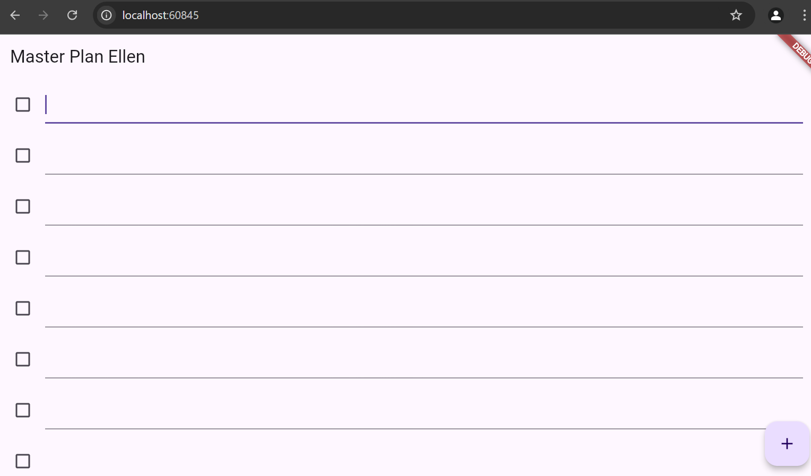
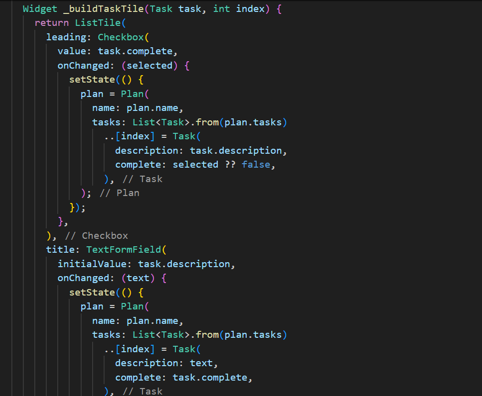

# master_plan

# Octavio Ellen Hariyadi | 362358302101

# Praktikum 1
No 1

No 2
Perintah tersebut ertujuan untuk mengekspor file 'plan.dart' dan 'task.dart. Bertujuan untuk mengelompokkan beberapa file yang terkait dalam satu etry point supaya lebih mudah diakses. 

No 3
Variabel plan digunakan untuk enyimpan data/objek yang terkait, dan dapat ditampilkan dalam tampilan aplikasi. Alasan dibuat konstanta yaitu agar lebih efisien serta dapat mencegah data dari perubahan yang tidak disengaja. Selain itu dapat menghindari masalah yang ada pada perubahan nilai variabel. 

No 4

-Fungsi _buildTaskTile untuk menerima dua parameter Task task dan int index.
-Fungsi ListTile untuk membuat tampilan baris yang berisi elemen seperti Checkbox dan TextFormField.
-Fungsi Checkbox untuk menampilkan status penyelesaian tugas. 
-Fungsi TextFormField berfungsi untuk menampilkan dan mengedit deskripsi tugas. 

no 5
Fungsi pada method initState() untuk melakukan pengaturan pada variabel, seperti membuat objek yang diperlukan. Untuk method dispose() berfungsi untuk memanggil ketika widget tidak dapat digunakan dan akan menghapus dari widget tree.

# Praktikum 2 

No 1

No 2
InheritedNotifier<ValueNotifier<Plan>> digunakan karena InheritedNotifier bisa memungkinkan widget untuk mendengarkan perubahan pada objek tertentu, yaitu ValueNotifier<Plan>. Yang dimaksud ValueNotifier<Plan> adalah data yang diberi tahu oleh InheritedNotifier,jika data tersebut berubah maka widget yang bergantung pada InheritedNotifier akan diberi tahu juga. 

No 3
completedCount dan completenessMessage memiliki tujuan untuk menghitung dan menampilkan status penyelesaian tugas dalam bentuk pesan. Ini dibuat untuk menyediakan informasi jumlah tugas yang sudah selesai. 
